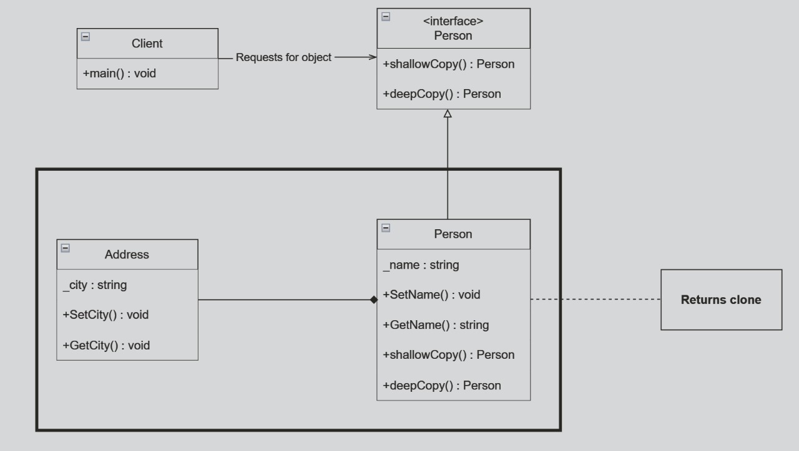

# Prototype Design Pattern

This code demonstrates the Prototype design pattern, a creational pattern that allows creating new objects by copying an existing object, known as a prototype. In this example, we have a `Person` class that acts as a prototype, and we create shallow and deep copies of this prototype.

### Shallow Copy

A shallow copy is a copy of an object that duplicates the structure of the original object, but not the underlying data. It means that a shallow copy points to the same referenced objects or data as the original object, rather than duplicating the actual objects themselves. Modifications to the shallow copy can affect the original object, especially if the objects being referenced are mutable (can be changed).

### Deep Copy

A deep copy is a copy of an object that not only duplicates the structure of the original object but also creates new instances of the data within the original object. In other words, a deep copy results in a new object with new copies of the data, ensuring that changes to the copied data do not affect the original object.

## Classes

 - `Address` : Represents an address with a city field and methods to set and get the city.
 - `Person` : Represents a person and has methods to set name, get name, create shallow copy, and create a deep copy.
 - `Program` : Contains the Main Method for the entrypoint.

## Unit Test

 - `TestSetNameAndGetname` : Tests setting and getting a person's name and address.
 - `TestShallowCopy` : Tests the creation of a shallow copy and its behavior.
 - `TestDeepCopy` : Tests the creation of a deep copy and its behavior.
 - `TestToString` : Tests the ToString method of the Person class.
 
 
